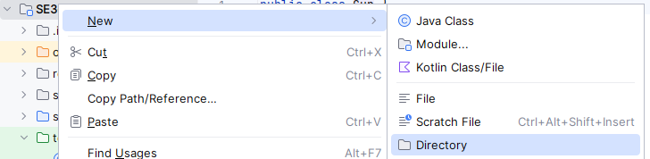
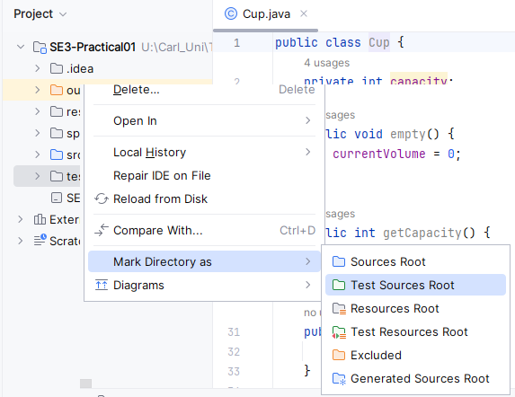
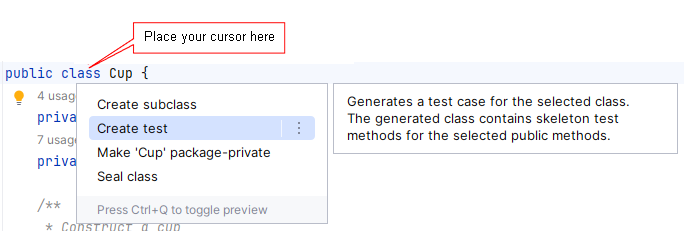
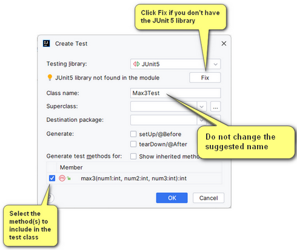
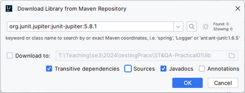

## Practical 1

### Getting Started

**_It is important that you fully read the instructions before you begin to code!_**

### Task 1

Open the class `Max3` (it is listed below).

```java
public class Max3 {
   public static int max3(int num1, int num2, int num3) {
      return -1;
   }
}
```

The class contains a **method stub** named `max3` which is **supposed** to return the largest of its three integer
parameters.  
For example (if we had a class to run the `max3` method),

```java
public class Max3Driver {
   public static void main(String[] args) {
      int max = Max3.max3(9, 3, 4);
      System.out.println(max);
   }
}
// should output "9" (without the quotes), but at present outputs -1
```

_**Do not change the implementation of the max3 method just yet.**_

### Creating the appropriate JUnit 5 tests for the method.

<b>Information:</b> If you don't have a test root directory for your project click on the **Directions** link and follow
the steps to create one.
<details>
<summary><hintfont><b>Directions</b></hintfont></summary><br>
1. create a new directory, named <b><i>test</i></b>, at the same level as <b>src</b> by `right-clicking` the project name and
   selecting <b>New | Directory</b>   

  <br><br>

2. Once created `right-click` the directory (just created) and select **Mark Directory As | Test Sources Root** <br>

    <br><br>

3. The test folder should be marked with the  icon

</details>  
<br>

#### Adding a new test

1. In your production code in the editor, place the cursor at the class for which you want to create a test, press
   <kbd>Alt</kbd><kbd>Enter</kbd> for Windows, or <kbd>⌥Opt</kbd><kbd>↩Enter</kbd> for Mac, and select <b>Create Test
   </b>.  
     <br><br>
2. In the _Create Test_ dialog, select the library that you want to use (**_JUnit 5_**).  <br><br>

     <br><br>
   If you don't have the necessary library yet, you will be prompted to download it. To do that, click **Fix**, and you
   should see a dialog box similar to the graphic below.
   <br><br>
   _JUnit 5 Dialog after clicking Fix_ - leave as is and click **OK**  <br>  
     <br><br>

   Once you have installed JUnit 5, configure the test class name and optionally its location and select the methods
   that you want to test. Click <b>OK</b>. <br><br>
3. The result is that IntelliJ IDEA creates a new test class with the specified name and generated test methods in the
   **Test Sources Root**.

Further information is available at: [Create Tests](https://www.jetbrains.com/help/idea/2023.3/create-tests.html)

> Note that JUnit tests generally do not print out the result of calling a method. They typically store the value in a
> variable and compare it with an expected result using one of the <samp>assert??</samp> methods from the
<samp>org.junit.jupiter.api.Assertions.*</samp> classes.  
> The test code generated by IntelliJ IDEA (which you will need to add additional tests to) has this structure.

Add more <samp>@Test</samp> annotations to **_comprehensively_** test the **expected** output of <samp>max3</samp>

---  

> <hintfont><b><i>EXPECTATION:</i></b> You should have at least 6 tests to comprehensively test this method</hintfont>

---  
To run your tests, see: [Run Tests](https://www.jetbrains.com/help/idea/2023.3/performing-tests.html)

**At this point your method stub should _fail_ most, if not all, the tests**.

Now you should implement the `max3` method so that it _**does**_ return the maximum of its three parameters.  
**_A working solution should pass all the tests_**.

---

### Task 2

The file `Cup.java` contains code that models a Cup. It has methods to create, fill, empty, get its capacity, get the
amount of liquid currently contained in the cup, and to find out whether the cup is currently empty or full.  
Read the code to ensure you understand how this class works.

For this task you are required to write tests for all methods contained in the class. You **will** make use of
the `@DisplayName` annotation for the tests. You may also wish to make use of the `@ParameterizedTest` annotation, but
this is not necessary for you to fulfill the requirements.

---  

> <hintfont><b><i>EXPECTATION:</i></b> You should have at least 7 tests to comprehensively test this method</hintfont>

---  

### Task 3

The file `BmiCalculator.java` contains code to calculate the BMI after entering a weight (in kilograms) and a height (in
metres).  
Read the code to ensure you understand how this class works.

For this task you are to write tests to ensure the <samp>constructor</samp> and the <samp>accessor</samp> (getter)
methods are working correctly, and a test using the `@ParameterizedTest` annotation to ensure that the `calculateBMI`
method is behaving as it should.

> <hintfont><b><i>EXPECTATION:</i></b> You should have at least 2 tests to comprehensively test this class</hintfont>

---

### Task 4

The file `Factorial.java` contains a program that calls the factorial method to compute the factorials of integers
passed as a parameter.

**_Write a class with a_** <samp>main</samp> **_method to see how it works._**  <br><br>
Try several positive integers, then try a negative number. You should find that it works for small positive integers (
values < 17), but that it returns a large negative value for larger integers and that it always returns 1 for negative
integers.

1. Returning 1 as the factorial of any negative integer is not correct (mathematically, the factorial function is not
   defined for negative integers). To correct this, you could modify your factorial method to check if the argument is
   negative, but then what? The method must return a value, and even if it prints an error message, whatever value is
   returned could be misconstrued. Instead, it should throw an exception indicating that something went wrong, so it
   could not complete its calculation. You could define your own exception class, but there is already an exception
   appropriate for this situation -`IllegalArgumentException`, which extends RuntimeException. Modify your
   program as follows:
   - Modify the header of the `factorial` method to indicate that factorial can throw an `IllegalArgumentException`.
   - Modify the body of `factorial` to check the value of the argument and, if it is negative, throw an
     `IllegalArgumentException`.
      <details>
       <summary><hintfont><b>Hint:</b></hintfont></summary>

     > What you pass to <i>throw</i> is actually an instance of the <code>IllegalArgumentException</code> class,
     and that the constructor takes a <code>String</code> parameter. Use this parameter to be specific about what
     the problem is (see the output below).

      </details>
   - Run your Factorials program after making these changes. Now when you enter a negative
     number an exception will be thrown, terminating the program. The program ends because the exception
     is not caught, so it is thrown by the main method, causing a runtime error.
   - Modify the main method in your Factorials class to catch the exception thrown by factorial and print an
     appropriate message, but then continue with the loop. Think carefully about where you will need to put
     the `try` and `catch`.
2. Returning a negative number for values over 16 also is not correct. The problem is arithmetic overflow - the
   factorial is bigger than can be represented by an int. This can also be thought of as an `IllegalArgumentException` -
   _this factorial_ method is only defined for arguments up to 16. Modify your code in the `factorial` method to check
   for an argument over 16 as well as for a negative argument. You should throw an `IllegalArgumentException` in either
   case, but pass different messages to the constructor so that the problem is clear (see the output below).<br><br>

   A run of the program could look like the following (user input is shown <b><mark>highlighted</mark></b>):  <br><br>

   **<tt>
   Enter an integer: <mark>5</mark>  
   Factorial(5) = 120  
   Another factorial? (y/n): <mark>y</mark>  
   Enter an integer: <mark>-2</mark>  
   java.lang.IllegalArgumentException: Factorial is undefined for negative integers  
   Another factorial? (y/n): <mark>y</mark>  
   Enter an integer: <mark>25</mark>  
   java.lang.IllegalArgumentException: Factorial(25) is too large - overflow occurs!  
   Another factorial? (y/n): <mark>y</mark>  
   Enter an integer: <mark>8</mark>  
   Factorial(8) = 40320  
   Another factorial? (y/n): <mark>n</mark>  
   </tt>**<br>

3. Once you have completed writing the <samp>factorial</samp> method, write tests to ensure that it behaves as it
   should.  <br><br>

   > <hintfont><b><i>EXPECTATION:</i></b> You should have at least 3 tests to comprehensively test this
   method</hintfont>
