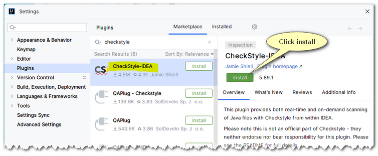
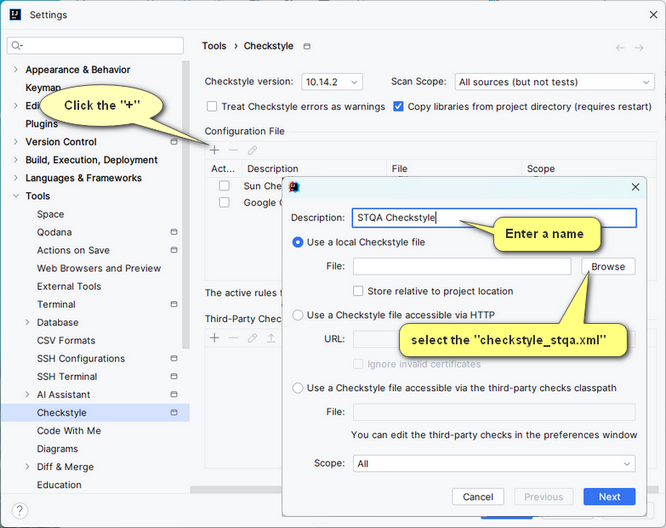
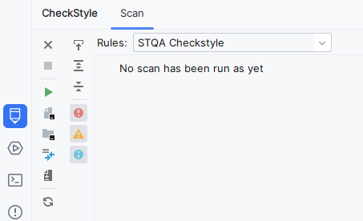

## Installing and Configuring CheckStyle-IDEA

### Installing the plugin
1. Go to **Settings | Plugins...**
2. Select Marketplace and search for "checkstyle"
3. You should see something similar to the following: 

	

	Click install and then restart the IDE when instructed to do so.
4. Go to **Settings | Tools | Checkstyle** 

   

   After selecting the `checkstyle_stqa.xml` file click **Next** then **Next** and then finally **Finish**.  
   Then click **OK** to exit the **Settings** dialog box.
5. You should then see the following icon in IntelliJ .  
	Clicking on the icon will allow you to check your code against the `checkstyle` configuration.  

   	